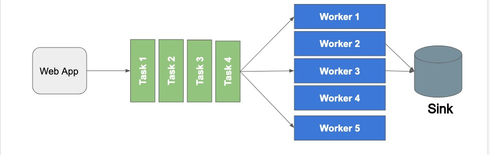

# Task Queues


**Figure 1**. Preview image of frontend implementation.

## General idea

The frontend ([`React.js`](reactjs.org)) will generate a request (through [`GraphQL`](https://graphql.org/) endpoints) to the backend in order to create new tasks. The backend (`Django`) will respond with a task item scheduled for running which is seen in the table with a `QUEUEING` status. 

[](creately.com)

**Figure 2**. Simplified design of the stack implemented.

[`RabbitMQ`](https://www.rabbitmq.com/) now handles the distribution of one or several tasks (which may be created by one or several users) using the `Work Queue` design pattern shown below. One of the clients is the `Django` backend whom creates the tasks by pushing a json payload to a queue into the RabbitMQ Server. Then this message system distributes the work to the `Julia` workers. When a certain task is set to run its status changes to `RUNNING`. Right now two things can happen:

- The task fails with `FAILED` status. Currently in this project we make *40%* of the tasks to fail just for illustration.

- The task completes with `FINISHED` status. In this case the result is pushed to a `Sink`. This sink in the future might preserve the results in a separate database. Later, the sink mutates the django backend status with the calculated value.



**Figure 3**. [Work queue](https://www.rabbitmq.com/tutorials/tutorial-two-python.html) pattern used in the project to queue tasks.

Finally, a long polling connection between the frontend and the backend is made so the results are updated in a table.

As a side note, this pattern allowes us to recover the tasks assigned to a worker in case it is shut down for some reason and assign them to other free workers or remain in memory if all the workers are busy.

Below, there is a small video showcasing the project capabilities.

[](https://youtu.be/8aVgLDDIEdg)

# Instructions 

## Installation

1. Install julia dependencies from `Worker` and `Sink`

```sh
cd results/Worker
julia
PRESS ']' KEY
activate .
instantiate
```

and repeat the process inside the `Sink` folder.

2. Install `frontend` dependencies

```sh
cd frontend
npm run install
```

3. Install `backend` dependencies

```sh
cd backend
pipenv shell
pipenv install
````

## Running 

### Development

Running all the stack is simple by using the provided script

```sh
./RUN.dev.sh [--workers|-w N]
```

where `N` is the number of workers we want to deploy. Default: `N = 1`.

### Production

Simply go to:
[```https://mattborghi.github.io/background-tasks-queue/```](https://mattborghi.github.io/background-tasks-queue/)

> The system might be offline. If you want to check it out just contact me.